# AI Proofread

> A Flask service that uses an LLM to proofread customer text — **without ever
> letting the LLM see personally-identifiable information.**

This is the sanitized portfolio version of a production service originally
built for a background-check screening company ("the Company"). Company-specific
identifiers, client data, and credentials have been removed; the technical
design and code are intact.

---

## What it does (plain language)

The Company processes thousands of background-check reports per month. Every
report is a free-form text document — interview notes, employment histories,
address verifications — that needs cleaning up before it goes to a human
reviewer: fix grammar, normalise phone numbers and dates, tidy wording.

Doing that by hand is slow. Doing it with a Large Language Model is fast — but
naive LLM calls would mean sending names, ID numbers, addresses, and phone
numbers of real people to a third-party API. That's a hard "no" under any
serious privacy regime.

**AI Proofread is the safe middle path.** Before any text reaches the LLM, the
service automatically finds every piece of PII (names, NIK / national IDs,
phone numbers, addresses, emails, organisation names, dates, URLs, social
handles, IPs) and replaces it with a placeholder like `[PHONE_NUMBER_3]` or
`[PERSON_1]`. The LLM only ever sees the placeholders. After it returns the
corrected text, the service swaps the placeholders back for the real values,
runs locale-aware reformatting (Indonesian phone numbers, dates, etc.), and
returns the result. Every run is logged for audit.

**The privacy promise:** PII never leaves the Company's infrastructure. The
LLM is a grammar assistant, not a confidant.

## Key features

- **Three-layer PII masking** — regex (`piiregex`) for emails / credit cards →
  `libphonenumber` for international phone shapes → custom regex catch-all for
  Indonesian-specific patterns (NIK, NPWP, `Jl.` addresses, `PT ... Tbk`
  org names, social handles, hashtags, dates in three calendars).
- **Token-integrity guarantee** — every `[CATEGORY_n]` placeholder must come
  back from the LLM in the exact same position. The prompt enforces it; the
  unmask step verifies it; mismatches fail closed.
- **Locale-aware reformatting** — Indonesian mobile / landline normalisation
  with `+`-freeze trick to prevent double-handling, intl phone formatting via
  a country-code map, date normalisation across three formats.
- **HTML round-trip** — input HTML is "frozen" into a skeleton + text-map
  before masking, then "reverse-filled" after proofreading, so the response
  preserves the original markup byte-for-byte where possible.
- **Per-run audit trail** — every stage (freeze, mask, LLM call, unmask,
  reformat, reverse) is persisted to its own MongoDB collection, plus a
  consolidated `summary_output` document with SHA1 / base64 fingerprints of
  the final HTML.
- **Multilingual NER** — per-tenant HuggingFace transformer models for
  Indonesian, Malay, and Thai entity recognition (loaded on disk; see
  [Setup](#setup--run)).
- **Strict request validation** — Pydantic with `extra = "forbid"`; unknown
  fields → HTTP 400.
- **Operational guards** — rate limiting, language-locale validation
  (Lingua + LLM fallback), semantic-text guard, optional SQLi / HTML-injection
  detection.

## Architecture / pipeline

```mermaid
flowchart LR
    A[Raw HTML] --> B[1. HTML Freeze<br/>skeleton + text_map]
    B --> C[2. PII Mask<br/>3 layers, shared counters]
    C --> D[3. LLM Proofread<br/>Claude with token-preserving prompt]
    D --> E[4. Unmask<br/>non-TEXT tokens → originals]
    E --> F[5. Reformat<br/>ID phones, dates, intl numbers]
    F --> G[6. Reverse HTML<br/>fill skeleton from final maps]
    G --> H[7. Persist<br/>per-stage Mongo collections + summary]
    H --> I[Response]

    style C fill:#fee,stroke:#c66
    style D fill:#eef,stroke:#66c
    style E fill:#fee,stroke:#c66
```



Stages 2 → 4 (red) are the privacy sandwich: the LLM (blue) is bracketed by
mask + unmask so it only ever sees placeholders.

## How it works (technical)

### 1. HTML Freeze (`app/modules/htmlmask`, `services/htmltags.py`)
Walks the input HTML, replaces every text node with a `[TEXT_xx]` token and
every `<table>` with a `[TABLE_xx]` token. Returns a *skeleton* (HTML
structure with placeholders) plus *maps* from each token back to its original
content.

### 2. PII Mask — three layers, shared counter (`services/masking.py`)
All three layers receive a single `counters: Dict[str, int]` so that token
IDs are unique across layers — `[PHONE_NUMBER_3]` always means the same span.

- **Layer 1** — `piiregex` for `EMAIL` and `CREDIT_CARD`.
- **Layer 2** — `libphonenumber.PhoneNumberMatcher` for international phone
  shapes, then a fallback regex for numeric-only phones that the library
  missed. Span-overlap protection prevents double-tokenisation.
- **Layer 3** — custom regex catch-all: URLs, social handles, hashtags,
  Indonesian month-name dates, numeric dates, Indonesian honorific + name
  (`Ibu`/`Bapak`/`Pak`/`Bu`), Indonesian PT-form company names (`PT ... Tbk`),
  16-digit NIK, NPWP, IP addresses, `Jl.` / `Jalan` addresses, and a final
  ID-phone fallback.

A `_find_token_spans` + `_overlaps` invariant ensures no regex can chew into
an already-tokenized region.

### 3. LLM call (`services/llm.py`, prompts in `llm_prompt/`)
The masked text plus a system prompt go to Anthropic's Claude. Prompts are
selected by `type_of_check` (`general` / `reference_check` / `employment_check`
/ `address_check`) and `format` (HTML / markdown / plain). The prompt
*commits* to preserve every `[CATEGORY_n]` token exactly and in original
order, and to never embed `[TEXT_*]` tokens inside JSON string values.
Temperature is 0 by default.

### 4. Unmask (`app/modules/masking/services.py`)
Walks the LLM output and replaces every non-`TEXT_*` token (e.g. every
`[EMAIL_*]`, `[PHONE_NUMBER_*]`, `[DATE_*]`, `[ORG_*]`) with its original
value from the layered map. `[TEXT_*]` tokens stay in place — they get
filled by stage 6.

### 5. Reformat (`services/phonefmt.py`)
Locale-aware number / date normalisation. Highlights:
- Indonesian mobile / landline rewriting (e.g. `0812-3456-7890` → `+62 812 3456 7890`).
- Greedy "021" landline normalisation.
- International phone reformatting via a country-code lookup map
  (`services/phone_world_cc.py`).
- The `+`-freeze trick — temporarily wraps `+CC` prefixes in a zero-width
  space so subsequent passes don't re-match already-handled tokens.
- Date normalisation across `dd/mm/yyyy`, English-month, and Indonesian-month
  formats.

### 6. Reverse HTML (`app/modules/htmlmask/services.py`)
Fills the skeleton from stage 1 with the final maps to reproduce the original
markup with the corrected text.

### 7. Persist (`services/db.py`)
Per-stage Mongo collections (`html_freeze`, `masking_output`,
`generative_output`, `unmask_output`, `final_reformating_output`,
`html_reverse`) plus a consolidated `summary_output` document with both UTC
and Jakarta-time (WIB) timestamps and SHA1 / base64 fingerprints of the
final HTML.

## Privacy & security design

This is the part that makes the service viable.

1. **PII never reaches the LLM.** The masking layer runs *before* every LLM
   call; the LLM only sees `[CATEGORY_n]` tokens. There is no flag, no
   debug path, no fallback that bypasses masking.
2. **Token preservation is a hard contract.** The LLM prompt declares the
   token format and the response shape; the unmask step assumes uniqueness
   and order. Dropping or reordering a token breaks the reverse-HTML step,
   so violations fail loudly rather than leaking.
3. **Shared counter across masking layers.** Every layer increments the same
   `counters` dict, so token IDs are unique across layers — there is no way
   for Layer 2's `[PHONE_NUMBER_3]` to collide with Layer 3's.
4. **Span overlap protection.** New regex patterns can't tokenize text that's
   already inside an existing `[CATEGORY_n]` token. Prevents malformed nested
   tokens like `[PHONE_NUMBER_[EMAIL_0]]`.
5. **Strict DTO validation.** `extra = "forbid"` on every `/proofread`
   request — unknown fields → HTTP 400. The attack surface is exactly the
   set of documented fields, no more.
6. **Per-run audit trail.** Every stage's input and output is persisted with
   a `report_id`. If anything looks wrong downstream, the full chain is
   reconstructable.
7. **Operational guards.** Rate limiting (Mongo-backed fixed window), opt-in
   SQLi-pattern and raw-HTML detection, a semantic-text guard that rejects
   nonsense input, and a language-locale guard (Lingua + LLM fallback)
   that rejects mismatched locale claims.
8. **Fail-safe optional features.** The masking-results dataset mirror and
   the Google-Sheets QA push are both behind strict `ON`-only toggles and
   default OFF; failures in either route through `safe_insert` and can
   never break the main response.

## Tech stack

- **Language / framework:** Python 3.11, Flask (app factory, blueprints per
  module), Gunicorn.
- **Validation:** Pydantic v2 (`extra = "forbid"`).
- **PII detection:** `piiregex`, `libphonenumber` (`phonenumbers`), custom
  regex.
- **NER:** HuggingFace `transformers` (per-tenant fine-tuned token-class
  models loaded from `ner_model/`).
- **LLM client:** `anthropic` SDK; Claude Sonnet 4.6 by default.
- **Language detection:** `lingua-language-detector` with Claude fallback.
- **Persistence:** MongoDB (`pymongo`).
- **Optional QA push:** Google Sheets API (`gspread` + `google-auth`).
- **Container:** Docker, docker-compose (Mongo + API + GPU runtime).
- **Tests:** `pytest` + `pytest-cov`.

## Project structure

```
ai-proofread/
├─ app/
│  ├─ app.py                         # Flask app factory
│  ├─ core/                          # config, rate limit, validation, language guard
│  └─ modules/                       # feature blueprints (htmlmask, masking, ner,
│     ├─ htmlmask/                   #   proofread, reformat, result_analyse, meta)
│     ├─ masking/                    # each has dto, repositories, routes, services
│     ├─ ner/
│     ├─ proofread/                  # the one-hit pipeline (/v1/proofread)
│     ├─ reformat/
│     ├─ result_analyse/             # optional Google-Sheets QA push
│     └─ meta/                       # /v1/meta/version, /v1/meta/healthz
├─ services/                         # shared services (cross-module)
│  ├─ masking.py                     # 3-layer PII masking
│  ├─ phonefmt.py                    # phone & date reformatting
│  ├─ phone_world_cc.py              # country-code → region map
│  ├─ llm.py                         # Claude client + prompt orchestration
│  ├─ ner.py                         # NER model load + inference
│  ├─ htmltags.py                    # HTML freeze / reverse
│  ├─ db.py                          # Mongo client + WIB timestamps
│  ├─ gsheets_client.py              # Sheets push for QA (optional)
│  └─ utils.py                       # header validation, locale helpers
├─ llm_prompt/                       # LLM prompts (HTML + plain variants)
├─ ner_model/                        # NER weights (NOT shipped — see Setup)
├─ tests/                            # pytest suite
├─ docs/                             # engineering reference docs
├─ Dockerfile, docker-compose.yml, wsgi.py
├─ .env.example                      # template (no secrets)
└─ README.md (this file)
```

## Setup & run

### Prerequisites
- Python 3.11+
- MongoDB (the included `docker-compose.yml` spins up a local one)
- An Anthropic API key
- (Optional) NVIDIA GPU + driver for NER acceleration

### Configure

```bash
cp .env.example .env
# Edit .env: set ANTHROPIC_API_KEY, MONGO_URI, API_KEY (any UUID), etc.
```

### NER model weights
`ner_model/` is **gitignored** because the fine-tuned weights are large and
proprietary in the original deployment. To run locally, place the per-tenant
model directories at:

```
ner_model/
├─ bert_large_cased/      # public — pull from HuggingFace `bert-large-cased`
├─ indonlu_ner_grit/      # Indonesian NER
├─ malay_ner/             # Malay NER
└─ thai_nner/             # Thai NER
```

Or override the model directory via the `NER_MODEL_DIR` env var.

### Run with Docker (recommended)

```bash
docker compose up --build
```

The API will be available at `http://localhost:2302/v1/...`. MongoDB runs on
its standard port (`27017`).

### Run locally (dev)

```bash
python -m venv .venv
.venv\Scripts\activate                # Windows PowerShell
# source .venv/bin/activate            # Linux / macOS
pip install -r requirements_base.txt -r requirements_ml.txt -r requirement_aiproofread.txt
python wsgi.py                         # binds to PORT (default 5000)
```

### Quick request

```bash
curl -sS -X POST "http://localhost:2302/v1/proofread" \
  -H "Content-Type: application/json" \
  -H "X-APIKey: <your-API_KEY>" \
  -H "X-Tenant: indonesia" \
  -H "X-Locale: id" \
  -H "X-TocType: general" \
  -d '{
    "type_of_check": "general",
    "tenant": "indonesia",
    "locale": "id",
    "format": "plain",
    "data": "Mohon hubungi 0812 3456 7890."
  }'
```

See [`docs/ENDPOINTS.md`](./docs/ENDPOINTS.md) for the full surface.

## Testing

```bash
pytest                                 # full suite
pytest --cov                           # with coverage
pytest tests/test_masking.py -v        # one file
```

Tests use synthetic placeholder data only — no real PII anywhere in the suite.

## What I built / skills demonstrated

This service was designed and implemented end-to-end as part of a screening
company's internal AI tooling platform. Areas demonstrated:

- **Privacy-by-design system engineering** — designed the mask → LLM → unmask
  sandwich so that PII *cannot* reach the LLM by construction, not by policy.
  Defined the token-integrity contract and the failure modes that enforce it.
- **Production-grade Python service** — Flask app factory, blueprint-per-module,
  strict Pydantic validation, per-blueprint rate limiting, structured error
  responses, version headers, health endpoints, configurable feature toggles.
- **Multi-stage NLP pipeline** — composed three independent PII-detection
  strategies (regex / `libphonenumber` / custom patterns) with a shared
  counter and span-overlap protection so they cooperate without colliding.
- **LLM integration with hard contracts** — designed the prompt around token
  preservation, validated the contract in code, and made violations fail
  loudly rather than silently leak.
- **Locale-aware text reformatting** — Indonesian phone / date / address
  formatting, international phone via country-code map, and the `+`-freeze
  trick to prevent double-handling across passes.
- **Operational concerns** — Mongo-backed rate limiting with in-memory
  fallback, WIB-aware timestamps, optional dataset mirror for model
  improvement with fail-safe write semantics, optional Google-Sheets QA
  push.
- **Test discipline** — `pytest` suite covering masking layers, regex
  invariants, the rate limiter, repositories, language detection, and
  endpoint behaviour. Tests use only synthetic placeholder data.
- **Docs as code** — engineering reference under [`docs/`](./docs/) covering
  pipeline, endpoints, env vars, and the invariants you can't violate
  without breaking the privacy contract.

## License

[MIT](./LICENSE).

## Disclaimer

This is a portfolio-sanitized version of a production service. Company name,
client identifiers, internal infrastructure (Mongo hosts, internal registries,
deployment URLs), credentials, person identifiers, and proprietary NER model
weights have been removed. The pipeline architecture, masking logic, prompt
contract, and operational design are intact and reflect the production code.
